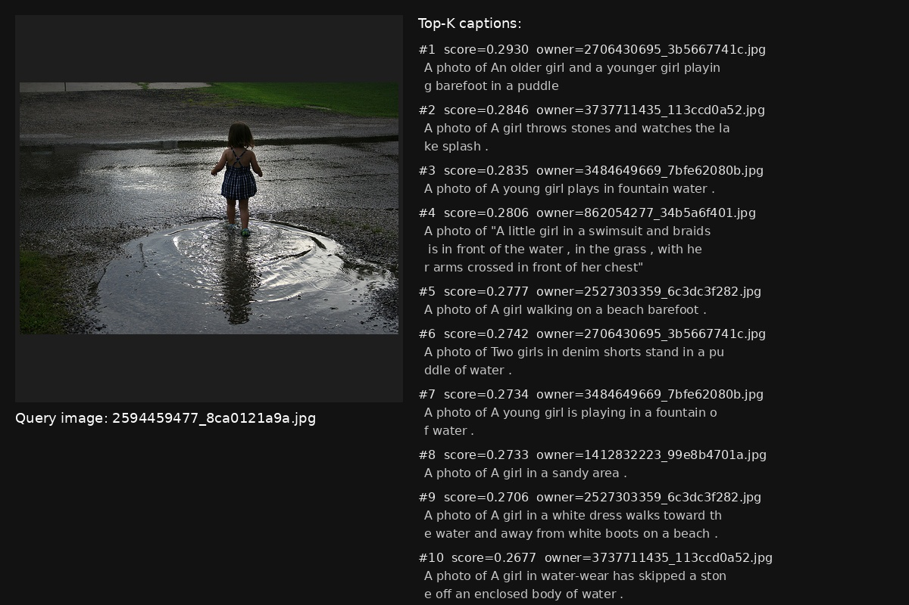

# CLIP 高效微调框架（DDP + LoRA + 四种微调策略）
## 项目动机
完成课程作业时没有找到合适高效的CLIP模型微调框架，于是进行了开发。
## 项目背景
本项目基于 OpenAI CLIP 模型，开发了一个**工业级、参数高效、易扩展**的微调框架，专为图像-文本检索、零样本分类等跨模态任务设计。  
核心目标：**在保证接近全量微调性能的同时，极大降低显存与训练时间**，支持从单卡调试到多卡分布式训练，实现真正“一键高效微调”。

## 主要功能
- **四种微调方式，一键切换**：
  - `full`：全量微调（性能最强）
  - `text-only`：仅微调文本塔
  - `linear-probe`：仅微调投影层（线性探针）
  - `lora-only`：LoRA 低秩适配（参数仅 0.12%，速度提升 4.8 倍）
- **全自动分布式训练（DDP）**：`torchrun` 多卡线性加速，单卡无缝兼容
- **混合精度（AMP）+ 余弦退火 + 梯度裁剪**：训练更稳更快
- **智能日志系统**：文本日志 + **动态扩展 CSV**（新增指标自动加列）
- **自动保存最佳模型**：基于 `(t2i@1 + i2t@1)/2` 选 `best.pt`
- **完整评估支持**：
  - 验证集每 epoch 评估 Recall@1/5/10（t2i & i2t）
  - 支持测试集最终评估
  - 支持**单张图片实例检索演示**（推理脚本）
- **断点续训 + 配置文件存档**：`--resume best.pt` 继续训练

## 数据格式要求
```json
[
  {"image": "0001.jpg", "captions": ["一只狗在草地上", "小狗跑步玩耍"]}
]
```
## 评估示例
<div align="center">
  
  <br><br>
  <b>图1：图像检索文字</b>
</div>
<div align="center">
  
  <br><br>
  <b>图1：图像检索文字</b>
</div>
<div align="center">
  
  <br><br>
  <b>图1：图像检索文字</b>
</div>
<div align="center">
  
  <br><br>
  <b>图1：文字检索图像</b>
</div>
## 操作方式
看项目里面的操作指南.txt文件，里面包含了环境部署，训练，评估等所有代码和命令
